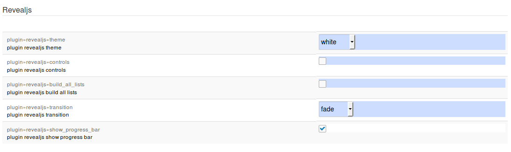

DokuWiki plugin Reveal.js
=========================

Reval.js plugin for DokuWiki

This started as a fork of Andreas Gohr's S5 plugin https://www.dokuwiki.org/plugin:s5.

It uses Reveal.js https://github.com/hakimel/reveal.js/.


Install
-------

Paste the address git config http://github.com/neuralyzer/dokuwiki-plugin-revealjs/zipball/master in the manual installation field or use Dokuwiki's extension manager.


Usage
-----

Add `~~REVEAL~~` to a page to insert a button for presentation start. In the past this was optional - now it is mandatory, because the plugin logic depends on the information, if reveal is used on the page or not. And the keyword `~~REVEAL~~` on the top of the page is used to indicate this.

Every new H1 or H2 section, that is 6 equal signs or 5 equal signs open per default a new slide horizontally.
New H3 sections (4 equal signs) are appended vertically if they follow after an H2 section.


Check also the source code of the [example presentation](example_presentation.dokuwiki)


Include plugin compatibility
----------------------------

Edit in the file dokuwiki/lib/plugin/include/syntax/wrap.php in the function render the line

```
if ($mode == 'xhtml') {
```
to

```
if ( ($mode == 'xhtml') && (! is_a($renderer, 'renderer_plugin_revealjs')) ) {
```
The include plugin will otherwise put some

```
<div class= "plugin_include_content ..." ...> ...</div>
```

at such places that the closing and opening div tags interfere with the reveal.js section tags.


MathJax compatibility
----------------------

At the moment this plugin loads MathJax from the MathJax CDN directly whether the Dokuwiki MathJax plugin is installed or not. It ignores Dokuwiki's MathJax plugin and the custom settings you might have made.


Configuration options
---------------------

Configuration is done in DokuWiki's configuration manager.




### Available themes

Available themes are the Reveal.js themes. Possible values:

  * black
  * white
  * beige
  * blood
  * league
  * default
  * moon
  * night
  * serif
  * simple
  * sky
  * solarized
  * dokuwiki (solarized with DokuWiki default theme background color, switched on image borders are recommended :-)

The default is white.


### Controls

Show the reveal.js controls. Two values

  * false
  * true

The default is false.


### Progress bar

Show the reveal.js progress bar. Two values

  * false
  * true

The default is false.


### Build all lists

Whether to build up all lists point by point. Two values

  * false
  * true

The default is false.


### Transition

The slide transition. Possible settings:

  * none
  * fade
  * slide
  * convex
  * concave
  * zoom

The default is fade.


### Horizontal slide level

Headers on this level or above starting a horizontal slide. Levels below starting a vertical (nested) slide - no effect on slides, which are indicated by alternative slide indicators (`---->` and `---->>`). Possible settings:

  * 1
  * 2

The default is 2.


### Enlarge vertical slide headers

Enlarge headers on slides below horizontal_slide_level - no effect on slides, which are indicated by alternative slide indicators (`---->` and `---->>`). Boolean:

* false
* true

The default is false.


### Image borders

Show image borders (default in Reveal.js). Boolean:

* false
* true

The default is false.


### Size

Base size of the slides in pixels - slides will bee zoomed to fit in the available space

* `<width>x<height>`
* Default is `960x700`


Supported dokuwiki syntax
-------------------------

Apart of the ordinary things like headlines, tables, italic, bold etc. the following syntax elements are supported:

  * alignment of images: either left or right or centered
  * dokuwiki plugin wrap's `<wrap lo></wrap>` and `<WRAP lo></WRAP>` produce also in the presentation smaller text.
  * `<WRAP clear></WRAP>` for clearing of floats


Extra syntax
------------


### Theme selection and button for presentation start

Putting on the top of the page a
```
~~REVEAL~~
```
will insert at this position a button. A click on this button then starts the presentation with the default theme.

Alternatively, to select a theme put a
```
~~REVEAL theme_name~~
```
with `theme_name` replaced by one of the reveal.js themes as listed under "Available themes".

All other options are also overwritable in a wiki page by using the URL query parameter syntax:
```
~~REVEAL theme=sky&transition=convex&controls=1&show_progress_bar=1&build_all_lists=1&show_image_borders=0&horizontal_slide_level=2&enlarge_vertical_slide_headers=0&show_slide_details=1&open_in_new_window=1~~
```
Please note that boolean values must be numeric (1 or 0). If you want to be able to change the options directly in the URL after the presentation has started, then you have to disable DokuWiki's caching by putting `~~NOCACHE~~` at the top of the page.


### Slide background

The plugin introduces the syntax

```
{{background>parameters}}
```

For all possible parameters see alternative slide indicator below.

The so defined background will be applied to the next slide. I.e. the background tag has to preceed the heading opening the next slide and will only apply to that slide. For example

```
{{background>:wiki:dokuwiki-128.png}}
===== my heading=====

slide with background

===== my second heading=====

slide without background
```

produces one slide with background and a second slide without background.


### Alternative slide indicators

```
---- salmon wiki:dokuwiki-128.png 10% repeat bg-slide no-footer ---->

<notes>
This slide has no content, but therefore a fancy background...
</notes>

<----
```

- `---->` opens a new slide with the default transition in the default speed (open previous slides will be closed implicitly)
- Full example - parameters are parsed dynamically like in CSS, the parameter order is not important and whitespaces are not allowed because we split all keywords on whitespaces: `---- orange wiki:dokuwiki-128.png 10% repeat bg-slide zoom-in fade-out slow no-footer ---->`
    - All possible HTML color names and codes are supported: `red`, `#f00`, `#ff0000`, `rgb(255,0,0)`, `rgba(255,0,0,0.5)`, `hsl(0,100%,50%)`, `hsla(0,100%,50%,0.5)`
    - Background images are recognized case insensitive by the endings gif, png, jpg, jpeg, svg and can be a DokuWiki image identifier (`:wiki:dokuwiki-128.png`) or a normal image link ('http://host.tld/path/to/image.png')
    - Background image size is recognized by postfix `%` and `px` or by keywords `auto`, `contain` and `cover` (cover is the default in Reveal.js) - example: `10%` or `250px` (it is generally recommended to use only percent values - they are scaling nice with the rest of the slide and the slide background preview on the wiki page shows you a "real" preview)
    - Background image position is recognized by keywords `top`, `bottom`, `left`, `right`, `center` (center is the default in Reveal.js) or alternative by x,y values in px or % - examples: `top left`, `bottom center`, `3%,5%`, `20px,5%` (the comma is needed to distinguish between image size and position - it is generally recommended to use only percent values - they are scaling nice with the rest of the slide and the slide background preview on the wiki page shows you a "real" preview)
    - Background image repeat is recognized by the keyword `repeat` (no-repeat is the default in Reveal.js)
    - Background transition: prefix `bg-` followed by `none`, `fade`, `slide`, `convex`, `concave` or `zoom`
    - Slide transition: `none`, `fade`, `slide`, `convex`, `concave` or `zoom` followed by optional postfix `-in` or `-out` for different transitions on one slide
    - Transition speed: `default`, `fast`, `slow`
- `---->>` opens a new slide container for vertical (nested) slides and a new slide with the given options - example: `---- red zoom ---->>`
- The next `---->>` will close the previous container (and slide) implicitly
- Technical details:
    - In the rendering the slide mode changes from "headers driven" to "special horizontal rule driven" - headers are no longer interesting in this mode for slide changes
    - You can create of course a whole presentation with this alternative slide indicator
    - if you want to leave this slide mode you need a way to explicit close a slide or container:
        - `<<----` closes a slide container (and possibly open slide inside)
        - `<----` closes a slide


### Footers

Sometimes you might want to have a footer for all the pages. This footer might contain your company's logo or similar things. Footers are most conveniently added using in addition the dokuwiki plugin "wrap". To get a footer on each page put at the very beginning of your document, i.e. before the first heading but possibly after a ``~~NOCACHE~~`` or ``~~REVEAL~~`` the following block
```
<wrap footer>Footer content here.</wrap>
```
This inserts a footer on every single page. If you want the footer to disappear for a specific page place before that page's heading a ``{{no-footer}}``. For example
```
{{no-footer}}
===== my heading=====

slide without footer


{{no-footer}}
{{background>:images:image1.png}}
===== my heading=====

Slide without footer and with background


{{background>:images:image1.png no-footer}}
===== my heading=====

no-footer as option in background definition


---- no-footer ---->

Slide with alternative slide indicator

---->

Next slide with footer and stop alternative
slide indicator mode

<----

```


### Speaker notes

- https://github.com/hakimel/reveal.js#speaker-notes
- keyword: `<notes>` (no parameters)
- No changes on wiki pages
- On a slideshow the content is wrapped into `<aside class="notes">` and invisible (only shown on speaker notes - shortkey s)
- Lists in notes are always NOT incremental, because the list is unvisible and you would have to press the next key for each entry without any obvious effect

Example:
```
<notes>
- your content
- here
</notes>
```


### Fragments

- https://github.com/hakimel/reveal.js#fragments
- `<fragment>` for inline usage (only formatting and substitutions supported)
- `<fragment-block>` for any wiki content
- `<fragment-list>` to overwrite the global option build_all_lists (if false)
- `<no-fragment-list>` to overwrite the global option build_all_lists (if true)
- support for style and index where possible - see also example_presentation.dokuwiki and http://lab.hakim.se/reveal-js/#/7/1

Example:
```
<fragment>Hit the next arrow...</fragment>

<fragment>... to step through ...</fragment>

<fragment>... a</fragment> <fragment>fragmented</fragment> <fragment>slide.</fragment>
```


PDF export
----------

Presentations can be exported as PDF. To do so append a `&print-pdf` to the URL. When you are able to edit the page,  there is a export PDF link rendered under the start slideshow button.

For example if the URL of your DokuWiki reveal.js presentation is usually
```
http://example-dokuwiki.com/doku.php?do=export_revealjs&id=example:page
```
you would have to change this manually in the address bar of your browser to

```
http://example-dokuwiki.com/doku.php?do=export_revealjs&id=example:page&print-pdf
```
After that the presentation looks weird in the browser but can be printed via you browser's print function.
Officially only Chromium and Chrome are supported for PDF export. Check also the  [Reveal.js PDF export documentation](https://github.com/hakimel/reveal.js#pdf-export).
